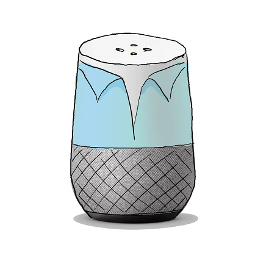

# Lara
Your virtual project manager

## Setup for local development
* create your local `instance/config.py`
* For local development (easier to debug):
    * run `pip install --upgrade -r requirements.txt`
    * run `alembic upgrade head` to initalize database. **IMPORTANT** `alembic` command must run in the same directory of the `alembic.ini` file
    * cd to `app` and run `python main.py` or `python main.py --help` for help
* For development inside docker ("production" setup):
    * run `docker-compose build && docker-compose up`
* run `ngrok http <port>`
* replace the dialogflow fulfillment webhook with your ngrok url
* if you want to test the github authentication workflow also replace the auth hook in the Github App

**IMPORTANT**: Change all urls to `https://ask-lara.de` after you are done developing!

## GitHub App
Lara will be distributed as a [GitHub App](https://developer.github.com/apps/building-github-apps/) that can be installed on organization or user accounts. Unfortunately this feature is very new and not yet supported by PyGithub, so we have to implement this by by ourselves.
- GitHub App API: https://developer.github.com/v3/apps/
- GitHub App Installation API: https://developer.github.com/v3/apps/installations/
