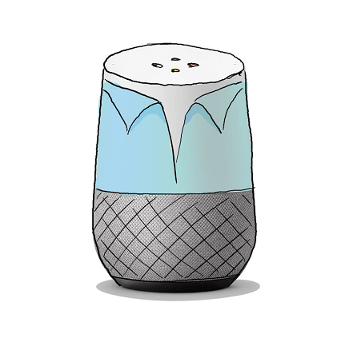

# Lara
Your virtual project manager

## Setup for local development
* create your local `instance/config.py`
* pull the latest database snapshot via `pull-database.sh`
* For local development (easier to debug):
    * run `pip install --upgrade -r requirements.txt`
    * cd to `app` and run `FLASK_APP=__init__.py flask run --port <port>`
* For development inside docker ("production" setup):
    * run `docker-compose build && docker-compose up`
* run `ngrok http <port>`
* replace the dialogflow fulfillment webhook with your ngrok url
* if you want to test the github authentication workflow also replace the auth hook in the Github App

**IMPORTANT**: Change all urls to `ec2-54-89-185-46.compute-1.amazonaws.com` after you are done developing!

## GitHub App
Lara will be distributed as a [GitHub App](https://developer.github.com/apps/building-github-apps/) that can be installed on organization or user accounts. Unfortunately this feature is very new and not yet supported by PyGithub, so we have to implement this by by ourselves.
- GitHub App API: https://developer.github.com/v3/apps/
- GitHub App Installation API: https://developer.github.com/v3/apps/installations/