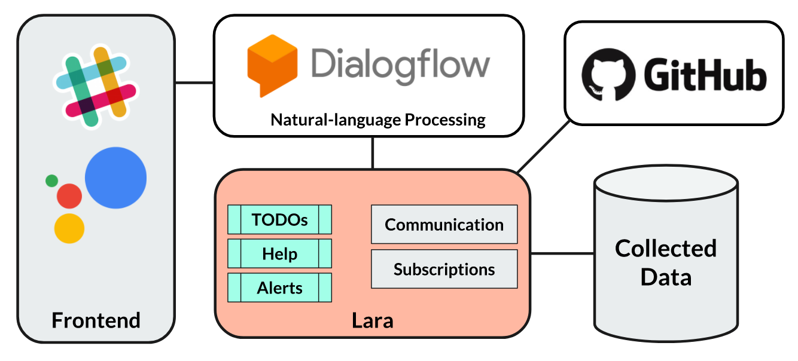
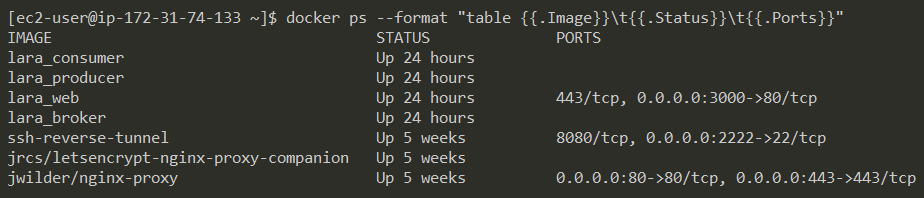

# Lara
Your virtual project manager

[Check out the demo video!](https://youtu.be/CL8gTM-HH2o)

## Features
Lara is currently in a prototype state and only supports a number of selected features:
1. __Authentication__ of users with Github OAuth and mapping between Slack Users and Github Users.
   This feature is automatically triggered once a unknown users asks Lara a question.
2. __Daily summary of tasks__, triggered by questions like "What do I have to do today?"
3. __Ask for help__ on specific topics within your or other organizations by asking questions like "I need help with Python and Docker" or "Search for an expert in Java at Google".
4. __Detection of approaching Milestones__. Lara automatically starts conversations with developers that still have a lot of open tickets at the end of a sprint and recomends them other developers that may have some time left and can help.

## Architecture

For a full overview of the architecture [watch out the demo video](https://youtu.be/CL8gTM-HH2o) and read the installation section.

A few additional comments:

* Lara currently only supports Slack as a frontend.
  Messages that are sent via Slack will be mapped to intents within Dialogflow and then passed to the Lara python server, that processes the requests.
* The sqlite database is only used to store the `Slack User <-> Github Account` mappings and the necessesary tokens for authentication.
* The Dialogflow import package `./chatbots/lara.zip` contains the trained models which map messages to intents. The project does currently not include further machine learning code.
* The `producer`, `consumer` and `broker` services in the `docker-compose.yml` are used to periodically crawl Github for approaching milestones and to initiate conversations. They are not necessary for any features of the schema Question -> Answer.

A screenshot of the services running on our EC2 instance:

As you can see, it's the four services from `docker-compose.yml` plus a few containers to manage the https connection.

## How to try out Lara
To try out the prototype you have two options: You can either install and set up everything from scratch or make use of the existing test environment.

### Install and set up everything from scratch

1. Create a [Dialogflow](https://dialogflow.com/) account and Agent
2. [Import](https://dialogflow.com/docs/Agents#export_and_import) our settings and trained models contained in `./chatbots/lara.zip`
3. Create a [Slack App](https://api.slack.com/slack-apps) and [connect it to Dialogflow](https://dialogflow.com/docs/integrations/slack#link_slack_to_dialogflow)
4. Set up either a publicly reachable server which you want to deploy Lara to, or a [ngrok](https://ngrok.com/) tunnel
5. Point your Dialogflow Agent's fulfillment webhook to `http(s)://<your server/tunnel url>/webhook`
6. Create a [Github OAuth App](https://developer.github.com/apps/building-oauth-apps/creating-an-oauth-app/) with the following settings
    * Homepage URL: `http(s)://<your server/tunnel url>`
    * Authorization callback URL: `http(s)://<your server/tunnel url>/auth`
7. Create a [Github organization](https://help.github.com/articles/creating-a-new-organization-from-scratch/) if you do not already have one
8. Adapt `app/instance/default.py`, especially the `URL` and `ORGANIZATION` (don't worry about the database, it will be created on the fly)
9. Create your local `app/instance/config.py` (you can use `app/instance/config.py.example` as a reference) and fill in your Github OAuth App and Dialogflow tokens
10. In case you run a ngrok tunnel or some https reverse proxy adapt the port mapping in the `web` service in `./docker-compose.yml`

#### Run Lara within Docker
To run all of Lara's services conveniently within Docker, run `docker-compose up`.

In case you run a ngrok tunnel or some https reverse proxy you may want to adapt the port mapping in the `web` service in `./docker-compose.yml` first.
By default the main service will be reachable on port 3000.

#### Run Lara locally
In case you do not have Docker or want to debug the code, you can also run Lara locally.
Note that in this case, Lara will not be able to start conversations though, as this requires multiple services to run.
The other features work as expected.

To run the code locally:

1. Run `pip install --upgrade -r requirements.txt` directly or within a virtual environment
2. Cd into the `app` directory y run `alembic upgrade head` to initialize the database
3. Run `python main.py` or `python main.py --help` for help

### Use the existing test environment
As Lara is based on many different external services and cumbersome to set up, you can also make use of our current test environment.
It consists out of a Slack App, a Dialogflow Agent, a Github OAuth App and a server running on AWS EC2.

The master branch of this git repository is automatically deployed to the EC2 instance on every commit, so you can be sure the latest version is the one you are testing at any time.

To request access to our test environment, write an email at p.wiesner[at]campus.tu-berlin.de containing your google email address. We will then invite you to our Slack Workspace and our Dialogflow Agent, where you can try out Lara by yourself.
